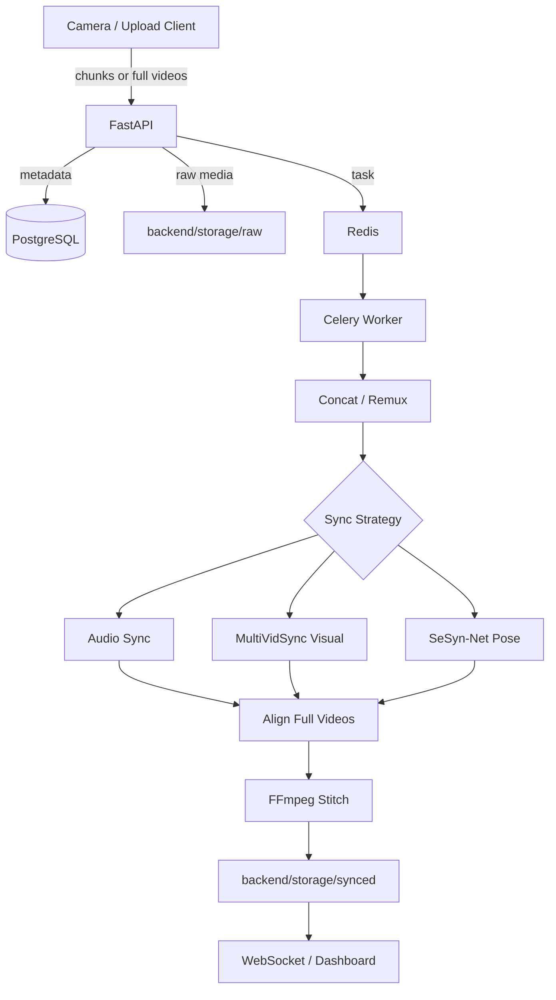

# VideoSync Pipeline

Multi-camera video capture, synchronization, alignment, and stitched export for browser/mobile camera sessions and uploaded test videos.

The pipeline accepts video from multiple devices, stores raw camera streams, computes temporal offsets, aligns every camera onto a shared timeline, and renders a combined output. It supports audio sync, visual/global sync, pose-based sync, and hybrid coarse-to-fine workflows.

---

## What The Pipeline Can Do

| Capability | What it does | Main requirements |
|---|---|---|
| Live multi-camera capture | Browser/mobile cameras join a session and upload chunks through the web app. | HTTPS for mobile camera access, Redis, PostgreSQL, worker running. |
| Manual/simulated uploads | Upload existing videos and run the same full-session sync pipeline. | One readable video per selected camera. |
| Full-session rendering | Concatenates all chunks per camera, computes offsets once, aligns full videos, then stitches a single export. | FFmpeg, enough disk for raw + aligned + output files. |
| Chunk preview pipeline | Processes chunk sets as they arrive for live preview-style output. | Complete chunk set for the expected camera count. |
| Audio synchronization | Cross-correlates audio streams to estimate offsets. | Each camera needs non-silent audio with a shared sound event. |
| MultiVidSync visual synchronization | Uses visual trajectories first, then robust frame/edge/motion similarity fallback. | Overlapping scene content and enough shared visible motion/texture. |
| SeSyn-Net pose synchronization | Uses YOLO pose keypoints and SeSyn-Net/GCN pose motion reasoning. | Visible humans, model weights, upstream source checkout. |
| Auto sync | Uses MultiSyncVideo for coarse sync, then SeSyn-Net fine tuning when possible; falls back to SeSyn-Net standalone if coarse sync fails. | Best general option when SeSyn-Net is configured. |
| Hybrid visual sync | Compares Feature-Based and SeSyn-Net visual estimates and selects/averages based on agreement and validation score. | Requirements of both visual feature sync and SeSyn-Net. |
| Stitched layouts | Renders `hstack`, `vstack`, or `grid_2x2`. | All selected cameras must align successfully. |
| Sync diagnostics | Saves `sync_report.json` with selected method, raw/final offsets, frame offsets, duration hints, and errors. | Full-session pipeline run. |

---

## Architecture



---

## Sync Strategies

### `auto`

Recommended when SeSyn-Net is installed. The code path is:

1. Run MultiSyncVideo as a coarse synchronizer.
2. Build a short coarse-aligned fine window.
3. Run SeSyn-Net on that fine window.
4. Add the small SeSyn residual to the coarse offsets.
5. If coarse sync fails, try SeSyn-Net standalone.
6. If fine tuning fails, keep the reliable MultiSyncVideo coarse offsets.

Requirements:
- At least two valid videos.
- For best quality, either shared audio, overlapping visual content, or visible human motion.
- SeSyn-Net source and weights are required only for the pose/fine stages.

Use when:
- You want the most robust default behavior.
- You have mixed sessions where some videos have audio and some do not.
- You expect manual start differences of several seconds.

### `multividsynch` / `multividsync` / `multisyncvideo`

General-purpose fast coarse sync:

1. Try audio cross-correlation.
2. If audio is missing, silent, or unreliable, try global visual feature sync.
3. If trajectory matching is weak, use frame/edge/motion similarity fallback.

Current tuning:
- Uses `20s` sync clips in full-session mode.
- Visual search supports offsets up to about `15s`.
- Rejects results near the search edge to avoid accepting saturated/ambiguous matches.

Requirements:
- Audio path: every selected camera needs a readable, non-silent audio stream.
- Visual path: cameras need overlapping scene content and visible change over time.

Strengths:
- Fast compared with deep pose inference.
- Works for silent clips when scene overlap is good.
- Good first stage for Auto coarse-to-fine sync.

Limitations:
- Different camera angles with little shared texture/motion can still be ambiguous.
- Repetitive motion or static scenes can produce low-confidence visual matches.

### `audio`

Audio-only cross-correlation.

Requirements:
- Every selected camera must have an audio stream.
- Audio must not be silent.
- Cameras should share a clear sound event or ambient track.

Use when:
- You recorded with microphones enabled.
- The same sound is present in all cameras.

Avoid when:
- Some clips are muted.
- Browser/device denied microphone permission.
- The scene has unrelated audio per camera.

### `feature_based` / `feature` / `cv`

Visual feature trajectory sync based on the MultiVidSynch-style AKAZE/trajectory approach, with fallback to frame/edge/motion similarity.

Requirements:
- At least two readable videos.
- Shared visual content between cameras.
- Enough motion or texture for features/trajectories.

Use when:
- Audio is unavailable.
- Cameras see the same scene from compatible angles.

Avoid when:
- Cameras face unrelated views.
- The scene is mostly static or textureless.

### `sesyn_net` / `sesyn` / `pose`

Pose-based synchronization using YOLO pose keypoints and SeSyn-Net/GCN-style pose motion.

Requirements:
- Visible people in the selected videos.
- `git` and network access for first-time upstream clone, unless already cloned.
- `cmu_syn.pth` model weights.
- Python ML dependencies from `backend/requirements.txt`.
- More CPU/GPU time than audio or visual feature sync.

Weights/source lookup:
- Source auto-clones to `backend/app/services/sesyn_net_approach/Sync-Camera`.
- Weights are searched at `backend/app/services/sesyn_net_approach/model/cmu_syn.pth` first.
- Fallback weight path: `backend/app/services/sesyn_net_approach/Sync-Camera/SeSyn-Net-main/model/cmu_syn.pth`.

Use when:
- The videos are human-centric.
- Audio is unavailable or unreliable.
- Camera angles differ enough that raw feature matching is weak.

Avoid when:
- People are not visible for enough frames.
- Pose detection is unreliable because of occlusion, blur, or tiny subjects.

### `hybrid` / `visual_hybrid`

Runs Feature-Based and SeSyn-Net visual estimates, then:

- averages them if they agree,
- scores candidate alignments if they disagree,
- uses SeSyn-Net as a low-confidence tie-breaker when validation is inconclusive.

Requirements:
- Same requirements as both `feature_based` and `sesyn_net`.

Use when:
- You are comparing visual methods during experiments.
- You want a diagnostic mode rather than the fastest mode.

---

## Output Layouts

| Layout | Value | Notes |
|---|---|---|
| Horizontal | `hstack` | Default. All cameras side by side. |
| Vertical | `vstack` | All cameras stacked top to bottom. |
| 2x2 grid | `grid_2x2` | Uses up to 4 cameras and pads missing tiles with black. |

Each tile is scaled/padded to an HD-compatible tile. Audio streams that survive alignment are mixed with FFmpeg `amix`.

---

## Storage Layout

```text
backend/storage/
├── raw/
│   └── {session_id}/
│       ├── chunk_0/
│       │   ├── cam1.mkv or cam1.mp4
│       │   └── cam2.mkv or cam2.mp4
│       ├── cam1.mp4                 # canonical full video after concat/remux
│       ├── cam2.mp4
│       ├── sync_clips/              # short clips used only for offset discovery
│       ├── aligned/                 # aligned full-video intermediates
│       ├── offset.json              # final offsets in seconds
│       └── sync_report.json         # diagnostics and selected method
├── synced/
│   └── {session_id}/
│       └── synced_full.mp4
└── master/
    └── {session_id}/
        └── master.mp4               # legacy/manual master pipeline output
```

Important behavior:
- Full-session mode concatenates chunks per camera before sync.
- Short `sync_clips` are only used to discover offsets; final rendering uses full videos.
- For chunked recordings, duration hints can correct offsets when cameras share an end time but not a start time.
- Missing audio in any chunk causes that camera concat to fall back to video-only concat instead of failing FFmpeg concat.

---

## Requirements

### Runtime

- Docker and Docker Compose.
- FFmpeg inside the backend image.
- PostgreSQL.
- Redis.
- Enough disk for raw uploads, repaired full videos, aligned intermediates, and stitched outputs.

### Browser / Camera

- `localhost` works for local camera testing.
- Mobile devices need HTTPS for camera permission. Use `make tunnel`.
- Camera/microphone permissions must be granted if you want audio sync.
- Browser MediaRecorder output can be `.mkv`, `.webm`, or `.mp4`; the backend repairs/remuxes to MP4 where needed.

### Python Dependencies

Installed by the backend image from `backend/requirements.txt`, including:

- FastAPI, SQLAlchemy, Celery, Redis client.
- FFmpeg Python bindings.
- OpenCV, NumPy, SciPy, scikit-learn.
- Torch and Ultralytics for SeSyn-Net.
- `asyncpg`, `psycopg2-binary`, and `aiosqlite` for runtime/test database drivers.

### SeSyn-Net Specific

The backend Dockerfile includes `git` so the upstream repository can be cloned on first use. The upstream checkout is intentionally ignored by Git.

Required model file:

```text
backend/app/services/sesyn_net_approach/model/cmu_syn.pth
```

Optional fallback location:

```text
backend/app/services/sesyn_net_approach/Sync-Camera/SeSyn-Net-main/model/cmu_syn.pth
```

---

## Quick Start

```bash
git clone https://github.com/teobun/sync_video_pipeline.git
cd sync_video_pipeline
cp .env.example .env
make up
```

Access points:

- Dashboard: `http://localhost:3000`
- API docs: `http://localhost:8000/docs`
- Health check: `http://localhost:8000/health`
- Nginx reverse proxy: `http://localhost:80`

Useful commands:

```bash
make logs
make restart
make down
make tunnel
```

After changing Python dependencies, rebuild the backend/worker images:

```bash
docker compose up -d --build backend worker
```

---

## Typical Workflows

### Live Recording

1. Start the stack with `make up`.
2. Open the dashboard.
3. Create or start a live session.
4. Open the camera page on each device.
5. Grant camera/microphone permissions.
6. Record and finalize.
7. The worker runs `process_full_session`, aligns full camera streams, and writes `synced_full.mp4`.

### Uploaded / Simulated Videos

1. Open the simulate/upload page.
2. Choose videos for each camera.
3. Pick sync strategy and layout.
4. Submit the session.
5. Inspect output and `sync_report.json`.

### Choosing A Strategy

The live/simulate UI currently exposes `auto`, `multividsynch`, and `sesyn_net`. The backend strategy resolver also accepts `audio`, `feature_based`, and `hybrid` for API/manual testing.

| Situation | Recommended strategy |
|---|---|
| General use with SeSyn configured | `auto` |
| Fast sync with shared audio or shared visual scene | `multividsynch` |
| Clean shared audio on all cameras | `audio` |
| Silent videos with overlapping scene content | `feature_based` or `multividsynch` |
| Human motion, weak audio, different angles | `sesyn_net` or `auto` |
| Comparing visual methods during testing | `hybrid` |

---

## Diagnostics

For full-session runs, inspect:

```text
backend/storage/raw/{session_id}/sync_report.json
backend/storage/raw/{session_id}/offset.json
backend/storage/ffmpeg_error.log
```

`sync_report.json` includes:

- requested strategy,
- selected method,
- raw offsets,
- final offsets,
- frame offsets,
- render trim offsets,
- duration hints,
- strategy details,
- non-fatal errors from fallback attempts.

Worker logs are usually the fastest way to understand a failed run:

```bash
docker compose logs -f worker
docker compose logs -f backend
```

---

## Troubleshooting

### Camera page cannot access camera

- Use `localhost` or HTTPS.
- For mobile devices, run `make tunnel`.
- Check browser permissions for camera and microphone.

### Audio sync fails

- Confirm every selected video has audio.
- Confirm audio is not silent.
- Use `multividsynch` or `auto` so the pipeline can fall back to visual sync.

### MultiVidSync returns a search-boundary error

This means visual sync found a best result near the allowed search edge and refused to trust it.

Try:

- use longer input recordings,
- ensure the first 20 seconds contain shared visual content,
- choose `auto` or `sesyn_net` if people are visible,
- verify the actual start difference is not larger than the visual search range.

### SeSyn-Net fails

- Confirm `cmu_syn.pth` exists in one of the expected paths.
- Confirm the upstream `Sync-Camera` checkout exists or the container has network access to clone it.
- Confirm people are visible for enough frames.
- Expect CPU runs to take much longer than audio/visual feature sync.

### FFmpeg concat/alignment fails

- Check `backend/storage/ffmpeg_error.log`.
- Browser chunks may miss audio; the full-session concat path handles this by falling back to video-only concat.
- If a file is fragmented or missing headers, the alignment code attempts remux/header repair.

### Processing takes too long

- Current Celery limits are `soft=900s`, `hard=1800s`.
- SeSyn-Net on CPU can be slow.
- Increase worker resources or run fewer cameras per session.
- Prefer `multividsynch` when pose sync is not needed.

### Clean all generated data

```bash
docker compose down
rm -rf backend/storage/raw/* backend/storage/synced/* backend/storage/master/*
docker compose up -d
```

Use `docker compose down -v` only if you also want to remove the PostgreSQL volume.

---

## Development And Testing

Run focused sync tests locally:

```bash
PYTHONPATH=backend pytest -q backend/tests/test_multividsync_visual.py
```

Run backend tests in an environment with all backend dependencies installed:

```bash
PYTHONPATH=backend pytest -q backend/tests
```

If using Docker, make sure tests are available inside the image/container or run them from a backend dev shell with the repository mounted.

---

## Project Structure

```text
backend/
├── app/
│   ├── routers/                    # API and live/session routes
│   ├── services/
│   │   ├── sync_pipeline.py         # full/chunk sync orchestration
│   │   ├── strategies.py            # strategy selection and Auto logic
│   │   ├── offset.py                # audio sync
│   │   ├── alignment.py             # trim/pad/remux alignment
│   │   ├── stitching.py             # FFmpeg layout rendering
│   │   ├── feature_based_approach/  # MultiVidSync-style visual sync
│   │   └── sesyn_net_approach/      # SeSyn-Net integration
│   └── workers/                     # Celery tasks
├── requirements.txt
└── tests/

frontend/
├── src/app/live/                    # live session UI
├── src/app/simulate/                # uploaded-video test UI
└── src/app/sessions/                # session reports and playback

nginx/
└── nginx.conf
```

---

## License

No project license file is currently included in this checkout.
